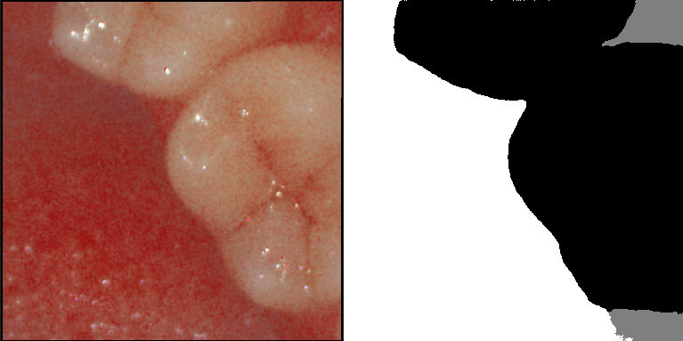

# DOF lab에서 제공한 구강 데이터와 UNet 활용한 segmentation 모델 
<h2>
DOF lab & INU 합작 프로젝트 수업
</h2>
<h4>
구강 내부를 스캔시 필요한 부분과 그렇지 않은 부분을 
빠르게 분리하기위한 모델 
이미지에서 이빨, 잇몸, 그 외로 구분
</h4>
<h4>
result
<h6>black=tooth, gray=gum, white=target</h6>
</h4>
<h4>
best case

learning curve

</h4>